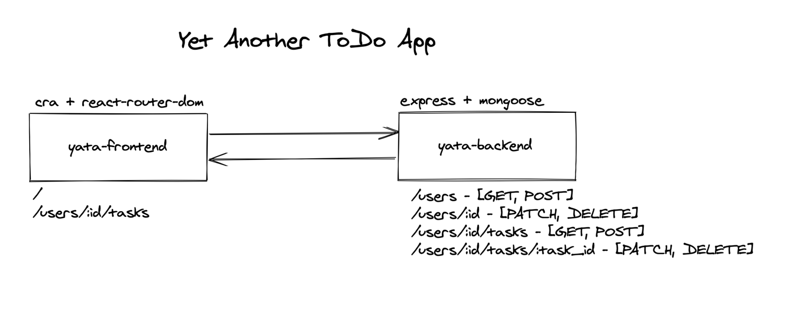
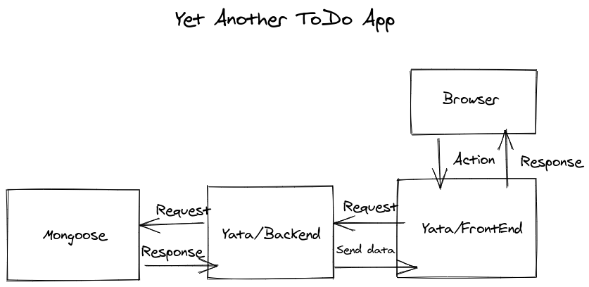

# YATA - Yet Another ToDo App

## Project Structure

The project is structured in a monorepo and handled by yarn workspaces.

## Set up

1. Clone the project
2. Run `yarn install`
3. Set up the env vars
   * Copy `packages/backend/.env.example` to `packages/backend/.env`
   * Copy `packages/frontend/.env.example` to `packages/frontend/.env`
4. Run the projects with `yarn start`

## Frontend

The frontend is built with CRA and react-router-dom

## Backend

The backend is built with NodeJS + Express + Mongoose

## Block Diagram

## Demo

* [Yata-FE](https://yata-carol-fe.herokuapp.com/)
* [Yata-BE](https://yata-carol-be.herokuapp.com/users)
